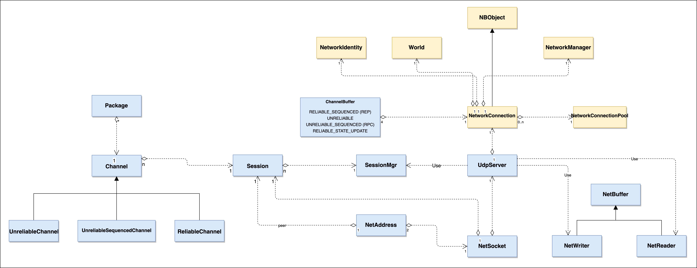

## Newborn Pvp Engine Networking
### billypu
---

## INDEX
---
* Introduction
* Relations of networking objects 
* Important classes of networking
* Communication mechanism between C&S
    - CMD, REP, RPC
    - Channel
    - Session
* How does networking data convert into gameobjects
---

## INTRODUCTION
---
* Network protocol：RUDP
* Session: logical object of connected client
* Channel: for networking data transition
    - Receive bytes from client and store into channel
    - Fetch the data from channel and send to client
---

## INTRODUCTION
---
* Four kinds of channels for different usage
    - UNRELIABLE_SEQUENCED
    - UNRELIABLE
    - RELIABLE_SEQUENCED
    - STATE_UPDATE 
---

## Relations of networking objects
---

--

## Important classes of networking
### - Session -
---
# TODO
